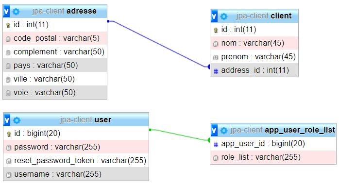

# Client03-jwt : Démo Spring Boot Security et JWT

Projet Gradle à importer dans Eclipse.
## EER correspondant

- *adresse* et *client* : 2 tables du TP client03 sur le mapping hibernate.
- *user* et *app_user_role_list* pour la gestion de l'authentification.

A la racine, vous avez un fichier *json* à importer dans Postman pour tester l'application.

## Modifications à faire dans *application.properties*

- Database à créer ou remplacer par un BD existante.
- username et password à remplacer
- pensez à faire un refresh des importations du Gradle

A vous de jouer !